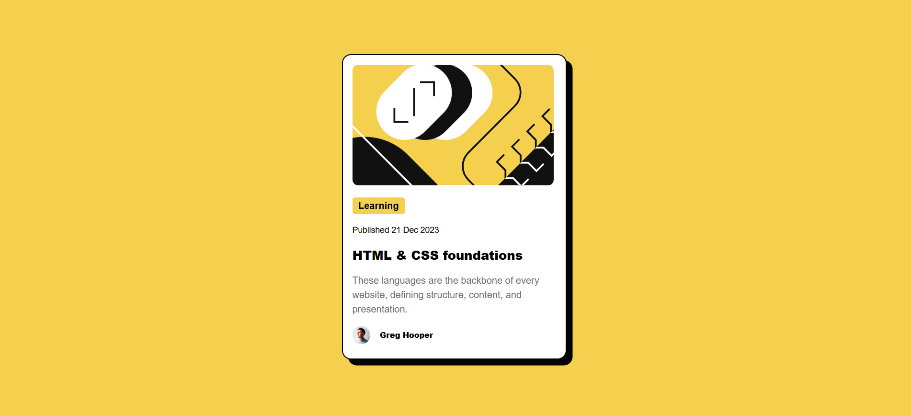

# Blog Preview Card 頁面

🟢 [立即查看 DEMO](https://gpyuan.github.io/blog-preview-card/)

這是參與 Frontend Mentor 挑戰製作的「部落格預覽卡片」網頁切版練習作品。

## 📸 預覽畫面



## 🔧 使用技術

- HTML5
- CSS3（使用 CSS 變數、Flexbox、響應式設計）
- 嵌入自訂字體（Figtree）
- 具備 RWD

## 🎨 樣式特色

- 使用 `flexbox` 將卡片內容在畫面中垂直與水平置中
- 卡片寬度自動縮放，最大寬度為 340px，並在小螢幕保留左右邊距
- 使用 `:root` 定義 CSS 變數以統一管理主題色
- 文字樣式設計清晰，並有較淡的輔助文字色

## 📁 專案結構

```
├── index.html 主頁面
├── style.css 樣式檔
├── images/ 圖片資源（含卡片插圖與頭像）
```
